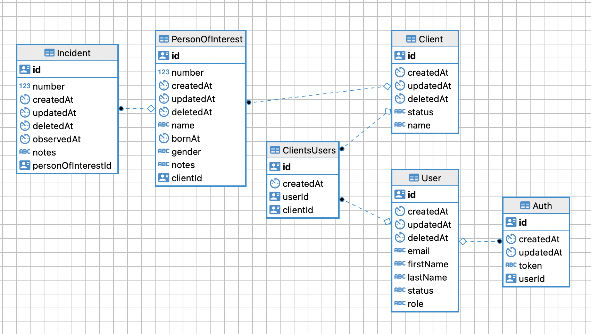

## CASL example project

## Integrating [CASL](https://github.com/stalniy/casl) for RBAC/ABAC implementation

### Getting Started

Clone this repo
```
git clone https://github.com/kuzimovich8/casl-example.git
```

Install dependencies
```
yarn install
```

Manage DB container
```
docker volume create \
--name casl-example-db-volume

docker run -d \
--name casl-example-db \
-e POSTGRES_PASSWORD=q1w2e3r4 \
-e POSTGRES_DB=casl-example \
-p 5452:5432 \
-v casl-example-db-volume:/var/lib/postgresql/data \
postgres:13.4
```

Start an app
```
yarn start:dev
```

### DB ER Diagram




